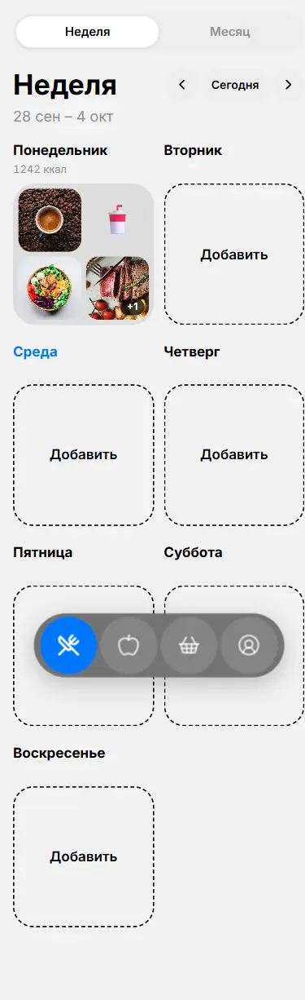
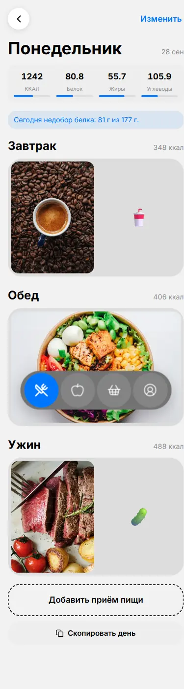
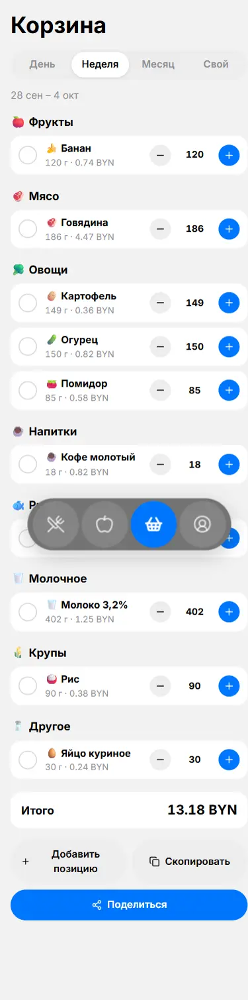
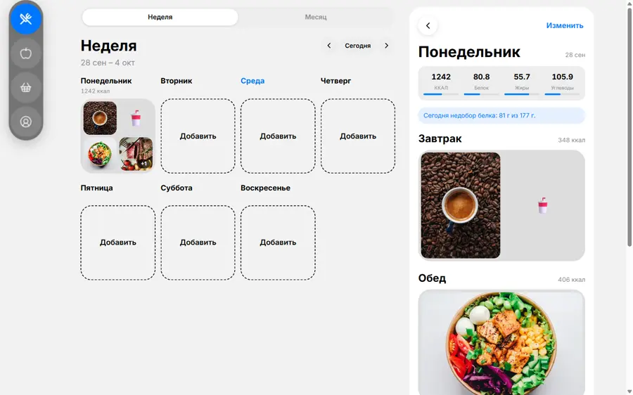

# FoodCrafter

Планирование питания на день, неделю и месяц. Приёмы пищи собираются из блюд и отдельных
ингредиентов, КБЖУ считается автоматически, а все продукты за выбранный период складываются
в список покупок.

**Сайт:** https://REPLACE_OWNER.github.io/foodcrafter/

Приложение открывается по ссылке и работает без регистрации: данные лежат в `localStorage`
браузера. При первом запуске показываются демо-данные — 12 ингредиентов, 5 блюд и заполненный
понедельник; их можно удалить кнопкой «Очистить демо-данные» в профиле.

## Экраны

| План | День | Продукты | Корзина |
|---|---|---|---|
|  |  |  |  |

На десктопе таб-бар превращается в вертикальную «таблетку» слева, а день открывается рядом
со списком недели:



## Возможности

**План.** Неделя и месяц, переключение стрелками и кнопкой «Сегодня». Карточка дня показывает
коллаж из фото блюд и сумму калорий; в календаре месяца у каждого дня цветной индикатор
относительно нормы. На экране дня — плашка КБЖУ с прогрессом, список приёмов пищи, режим
«Изменить» с переименованием, перетаскиванием и удалением свайпом (с кнопкой «Отменить»).
День и отдельный приём пищи можно скопировать на другую дату.

**Продукты.** Библиотека ингредиентов и блюд: поиск, фильтр по категориям, блок «Недавно
выбирали». У ингредиента — категория, КБЖУ на 100 г, вес штуки и цена за килограмм; фото
грузится с устройства и сжимается до 400 px. У блюда — состав с граммами, описание, время
готовки и число порций; КБЖУ и общий вес считаются по составу.

**Корзина.** Период — день, неделя (по умолчанию), месяц или свой диапазон. Блюда
раскладываются на ингредиенты с учётом веса порции, одинаковые продукты суммируются,
всё группируется по категориям. Есть отметка «куплено», ручная правка количества,
свои позиции, копирование списка и Web Share, а также строка «Итого» в BYN.

**Профиль.** Пол, возраст, рост, вес, активность и цель. Дневная норма считается по формуле
Миффлина—Сан Жеора, её можно переопределить вручную; БЖУ задаётся в процентах. Экспорт
и импорт всех данных в JSON, сброс с подтверждением, светлая/тёмная/системная тема.

## Стек

Vite · React 19 · TypeScript · Tailwind CSS 4 · Zustand (persist) · Framer Motion ·
React Router (HashRouter) · lucide-react · vite-plugin-pwa · Vitest.

Дизайн-токены сняты с макета Figma и вынесены в CSS-переменные (`src/index.css`).
Приложение ставится на телефон как PWA.

## Как запустить

```bash
npm install
npm run dev      # http://localhost:5173/foodcrafter/
npm run test     # unit-тесты расчётов
npm run build    # сборка в dist/
npm run preview  # посмотреть собранную версию
```

Базовый путь по умолчанию — `/foodcrafter/` (так требуется для GitHub Pages).
Для сборки под другой адрес задайте переменную окружения:

```bash
VITE_BASE=/ npm run build
```

## Структура

```
src/
  lib/       расчёты КБЖУ, нормы калорий, агрегация корзины, даты (+ тесты)
  store.ts   состояние Zustand с сохранением в localStorage
  data/      демо-данные
  components/ TabBar, MacroBar, MealCollage, DashedAddCard, ProductRow,
              Stepper, SegmentedControl, BottomSheet, IconButton, …
  screens/   План, День, Приём пищи, Продукты, Блюдо, Корзина, Профиль
```

Вся логика расчётов лежит в `src/lib/calc.ts` и покрыта тестами
(`src/lib/calc.test.ts`, `npm run test`).

## Деплой

При пуше в `main` workflow `.github/workflows/deploy.yml` прогоняет тесты, собирает проект
и публикует `dist/` на GitHub Pages.

## Лицензия

MIT — см. [LICENSE](LICENSE).

Фотографии блюд взяты из макета Figma (Unsplash+) и используются как демо-данные.
